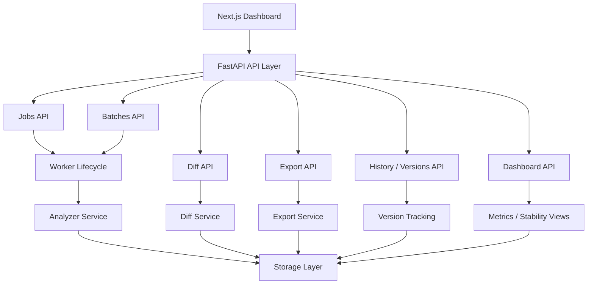
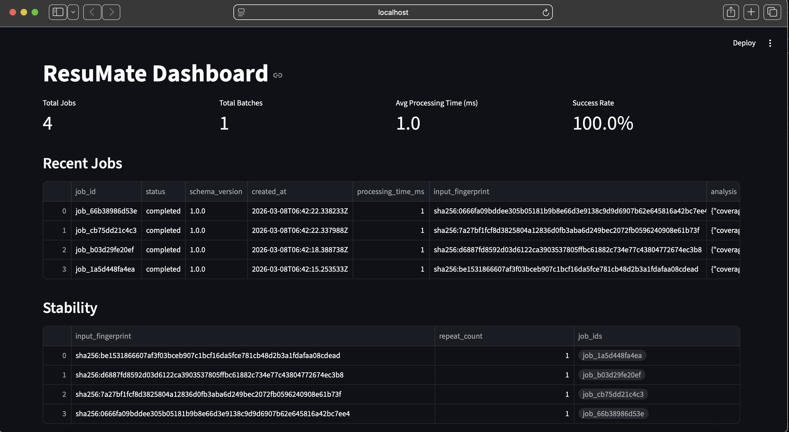

# ResuMate

> **An API-first workflow engine for structured document analysis and repeatable automation.**

ResuMate accepts single and batch document-analysis jobs, returns schema-validated JSON outputs, tracks history and input versions, supports diffing between runs, exports results in JSON and Markdown, and exposes summary metrics, recent jobs, and stability views in a React/Next.js dashboard.

> This is not an AI resume writer. The core problem is **repeatable document-analysis workflow with stable contracts**.

**Workflow:** `submit job` → `process asynchronously` → `compare runs` → `export report`

---

## Table of Contents

- [What It Does](#what-it-does)
- [Key Features](#key-features)
- [Current Prototype Snapshot](#current-prototype-snapshot)
- [Architecture](#architecture)
- [Screenshots](#screenshots)
- [Example Workflow](#example-workflow)
- [Status Model](#status-model)
- [API Overview](#api-overview)
- [Sample Requests & Responses](#sample-requests--responses)
- [Sample Job Timeline](#sample-job-timeline)
- [Response Schema](#response-schema)
- [Why Fingerprinting Exists](#why-fingerprinting-exists)
- [Project Structure](#project-structure)
- [Running the App](#running-the-app)
- [Running Tests](#running-tests)
- [Engineering Decisions](#engineering-decisions)
- [Architecture Notes](#architecture-notes)
- [What's Next](#whats-next)
- [Design Philosophy](#design-philosophy)

---

## What It Does

Given a source document (e.g. a resume) and a reference document (e.g. a job description), ResuMate processes them as a backend job and returns stable, machine-readable output that can be inspected, compared, versioned, and exported.

This mirrors internal productivity tooling where **repeatability, traceability, and contract-stable outputs** matter more than one-off generation.

---

## Key Features

| Feature | Description |
|---|---|
| **Structured job API** | Submit document pairs as jobs with a stable JSON response contract |
| **Input fingerprinting** | SHA-256 of normalized input for repeatability and deduplication |
| **Batch processing** | Submit multiple jobs in one request and retrieve aggregate results |
| **Version tracking** | Each job creates a version record for traceability during the current runtime session |
| **History** | List recent jobs with metadata |
| **Diff view** | Compare two job runs and see what changed between them |
| **Exports** | Export results as JSON or Markdown |
| **Dashboard** | Summary metrics, recent jobs, and stability grouping through a React/Next.js frontend |
| **Async lifecycle** | Jobs move through `queued`, `running`, `retrying`, `failed`, and `completed` states |
| **Timeline tracking** | Each job records lifecycle events for debugging and traceability |

---

## Current Prototype Snapshot

- **12 API endpoints**
- **7 workflow capabilities**: jobs, history, versions, batches, diff, exports, dashboard
- **2 export formats**: JSON, Markdown
- **12 automated tests passing**
- **GitHub Actions CI passing**
- **React / Next.js frontend dashboard**
- **FastAPI backend with structured response schemas**
- **Async job lifecycle with `queued` / `running` / `retrying` / `failed` / `completed` states**
- **Worker-driven processing with retry handling and per-job timeline tracking**

---

## Architecture



---

## Screenshots

### Dashboard



*Shows summary metrics, recent jobs, and stability grouping by input fingerprint.*

---

## Example Workflow

A typical ResuMate flow:

```
Submit document → create job → process asynchronously → review history → compare versions → export Markdown report
```

1. Submit a source document and reference document to `POST /v1/jobs`
2. Receive a job record with lifecycle state and fingerprint
3. Process the job through `queued` → `running` → `retrying` → `completed` or `failed`
4. Inspect prior runs through history and version endpoints
5. Compare two runs with `POST /v1/diff`
6. Export a job as JSON or Markdown for downstream review or reporting

---

## Status Model

ResuMate supports a small but useful async lifecycle model:

| Status | Description |
|---|---|
| `queued` | Job accepted by the API and waiting for worker execution |
| `running` | Worker started processing the job |
| `retrying` | Job hit an error and is being retried under retry policy |
| `failed` | Job exhausted retries or hit a terminal failure |
| `completed` | Job finished successfully and produced structured output |

---

## API Overview

### Core

| Method | Endpoint | Description |
|---|---|---|
| `GET` | `/health` | Health check |
| `POST` | `/v1/jobs` | Submit a new analysis job |
| `GET` | `/v1/jobs/{job_id}` | Retrieve a job by ID |
| `GET` | `/v1/history` | List recent jobs |
| `GET` | `/v1/versions` | List version records |

### Batch

| Method | Endpoint | Description |
|---|---|---|
| `POST` | `/v1/batches` | Submit multiple jobs at once |
| `GET` | `/v1/batches/{batch_id}` | Retrieve batch summary |

### Diff and Export

| Method | Endpoint | Description |
|---|---|---|
| `POST` | `/v1/diff` | Compare two job runs |
| `POST` | `/v1/exports/job/{job_id}` | Export a job as JSON or Markdown |

### Dashboard

| Method | Endpoint | Description |
|---|---|---|
| `GET` | `/v1/dashboard/summary` | Aggregate counts and metrics |
| `GET` | `/v1/dashboard/jobs` | Recent job list |
| `GET` | `/v1/dashboard/stability` | Stability grouping by fingerprint |

---

## Sample Requests & Responses

### `POST /v1/jobs`

**Request**

```json
{
  "document_text": "Built FastAPI services with tracing and observability.",
  "reference_text": "Looking for backend engineer with APIs and observability.",
  "document_type": "resume",
  "reference_type": "job_description",
  "metadata": {
    "document_name": "resume_v1",
    "reference_name": "backend_role"
  }
}
```

**Response**

```json
{
  "job_id": "job_123abc",
  "status": "completed",
  "schema_version": "1.0.0",
  "created_at": "2026-03-12T20:46:40.072803Z",
  "updated_at": "2026-03-12T20:46:40.074000Z",
  "processing_time_ms": 1,
  "input_fingerprint": "sha256:...",
  "analysis": {
    "coverage_score": 1.0,
    "matched_requirements": [
      {
        "requirement_id": "req_1",
        "requirement_text": "Looking for backend engineer with APIs and observability",
        "coverage": "partial",
        "evidence": [
          "Document contains signals relevant to: api, fastapi"
        ],
        "confidence": 0.65
      }
    ],
    "gaps": [],
    "suggested_actions": []
  },
  "errors": []
}
```

### `POST /v1/diff`

**Request**

```json
{
  "left_job_id": "job_left123",
  "right_job_id": "job_right456"
}
```

**Response**

```json
{
  "left_job_id": "job_left123",
  "right_job_id": "job_right456",
  "coverage_score_change": 0.12,
  "added_requirements": [
    "Looking for backend engineer with distributed systems and observability"
  ],
  "removed_requirements": [
    "Looking for backend engineer with APIs and observability"
  ],
  "changed_suggestions": []
}
```

---

## Sample Job Timeline

### Successful run

```json
[
  {
    "status": "queued",
    "timestamp": "2026-03-12T20:46:40.072803Z",
    "message": "Job accepted by API and queued for processing."
  },
  {
    "status": "running",
    "timestamp": "2026-03-12T20:46:40.073101Z",
    "message": "Worker picked up queued job."
  },
  {
    "status": "completed",
    "timestamp": "2026-03-12T20:46:40.074000Z",
    "message": "Job completed successfully."
  }
]
```

### Retry / failure path

```json
[
  {
    "status": "queued",
    "timestamp": "2026-03-12T20:46:40.072803Z",
    "message": "Job accepted by API and queued for processing."
  },
  {
    "status": "running",
    "timestamp": "2026-03-12T20:46:40.073101Z",
    "message": "Worker picked up queued job."
  },
  {
    "status": "retrying",
    "timestamp": "2026-03-12T20:46:40.073550Z",
    "message": "Retrying after error: transient analyzer failure"
  },
  {
    "status": "failed",
    "timestamp": "2026-03-12T20:46:40.074200Z",
    "message": "Job failed after retries: transient analyzer failure"
  }
]
```

---

## Response Schema

Every job response returns a stable, schema-versioned payload with fixed top-level keys:

```json
{
  "job_id": "job_123abc",
  "status": "completed",
  "schema_version": "1.0.0",
  "created_at": "2026-03-12T20:46:40.072803Z",
  "updated_at": "2026-03-12T20:46:40.074000Z",
  "processing_time_ms": 1,
  "input_fingerprint": "sha256:...",
  "analysis": {
    "coverage_score": 1.0,
    "matched_requirements": [],
    "gaps": [],
    "suggested_actions": []
  },
  "errors": []
}
```

Downstream consumers always receive stable keys, predictable array defaults, and machine-readable outputs.

---

## Why Fingerprinting Exists

Fingerprinting exists for three practical reasons:

- **Repeatability** — the same normalized input should map to the same fingerprint
- **Grouping** — repeated runs can be clustered together in history and dashboard views
- **Stability view** — fingerprints make it easy to surface identical-input runs and inspect output consistency over time

---

## Project Structure

```
app/
├── api/          # Route layer (jobs, batches, versions, exports, dashboard)
├── schemas/      # Request/response models, domain models, error models
├── services/     # Business logic (analysis, batching, diffing, exports, metrics)
├── storage/      # Persistence layer (currently in-memory; structured for Mongo restoration)
├── utils/        # Shared helpers (hashing, timing)
└── workers/      # Async job lifecycle and processing flow

frontend/         # Next.js dashboard
dashboard/        # Earlier Streamlit prototype assets
docs/assets/      # README screenshots
prompts/          # Build and implementation prompts
tests/            # Smoke, contract, integration, and schema validation tests
```

---

## Running the App

Install backend dependencies and start the API:

```bash
pip install -r requirements.txt
uvicorn app.main:app --reload --port 8002
```

In a separate terminal, start the frontend:

```bash
cd frontend
npm install
npm run dev
```

| Service | URL |
|---|---|
| Frontend | http://localhost:3000 |
| Backend | http://127.0.0.1:8002 |

---

## Running Tests

**Local full test run:**

```bash
python3 -m pytest -q
```

**Clean CI-style test run:**

```bash
python3 -m venv .venv-ci
source .venv-ci/bin/activate
pip install --upgrade pip
pip install -r requirements-ci.txt
python -m pytest -q -ra -vv
```

---

## Engineering Decisions

**Schema-versioned JSON contracts** — Outputs stay stable, testable, and easier to integrate with downstream tooling.

**SHA-256 input fingerprinting** — Supports repeatability checks, deduplication detection, and stability grouping across repeated inputs.

**Fallback analyzer mode** — Preserves schema-valid output even when model-backed analysis is unavailable, keeping API behavior predictable.

**CI-safe config handling** — Tests and clean environments do not require production-only settings at import time.

**Slim CI requirements** — Separated from the full local requirements path to avoid heavyweight dependencies and improve pipeline reliability.

---

## Architecture Notes

### Analyzer

The current analyzer uses a rule-based fallback mode that produces schema-valid output using heuristic matching. This keeps the API contract stable and the system fully testable while the model-backed analysis path is in development.

### Storage

State is currently held in-memory for local prototyping. The storage layer is structured to support Mongo-backed persistence, but persistence is temporarily disabled while the local or managed connection path is being restored. State does not survive restarts in the current prototype.

### Async lifecycle

Jobs are accepted immediately, assigned a lifecycle state, and processed through a worker path that records timeline events and retry attempts. This gives the platform a more realistic internal-tooling execution model than a single synchronous request/response flow.

---

## What's Next

- [ ] Add auth, roles, and audit trail for multi-user/admin workflows
- [ ] Restore Mongo persistence for jobs, batches, versions, and exports
- [ ] Re-enable model-backed analysis with structured output validation
- [ ] Expand test coverage beyond current contract, smoke, and integration paths
- [ ] Add observability through metrics, structured logging, and latency/error tracking
- [ ] Improve dashboard UX with richer diff visualization and run comparison views

---

## Design Philosophy

ResuMate is framed as an internal tooling system, not a consumer AI product.

The emphasis is on:

- **Stable API contracts** over free-form generation
- **Repeatable, traceable workflow execution**
- **Structured outputs** that are testable, exportable, and automatable
- **Operational clarity** through history, versioning, diffing, lifecycle states, and dashboard visibility

The resume-analysis use case is the vehicle. The backend workflow system is the point.